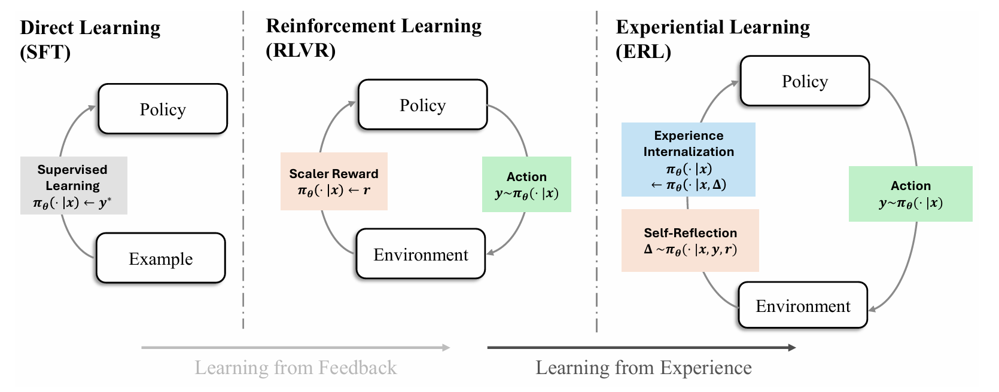
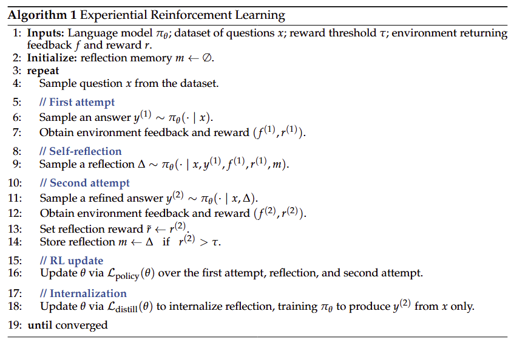

<div align="center">

# Experiential Reinforcement Learning

<div>
🚀 Experiential Reinforcement Learning for Language Agents 🌟
</div>
</div>
<div>
<br>

<div align="center">
  
[](https://arxiv.org/abs/2602.13949)
[](https://www.microsoft.com/en-us/research/articles/experiential-reinforcement-learning/?msockid=33433ab7aae660672c0a2db2abf2613f)
[](https://x.com/taiwei_shi/status/2023758117746733265?s=20)

</div>

</div>

This repository implements **Experiential Reinforcement Learning (ERL)**, enabling post-training of language agents through an explicit experience–reflection–consolidation loop. Instead of relying solely on reward optimization, ERL enables agents to learn through structured reflection and refinement, turning environmental feedback into durable behavioral improvements. This repository provides the tools to build custom agents and environments, train them with ERL, and deploy adaptive agents capable of tackling complex, real-world tasks.



## Algorithm Overview

Experiential Reinforcement Learning (ERL) embeds an explicit experience–reflection–consolidation loop into reinforcement learning so that language agents can learn from interaction and internalize improvements. For each task, the agent produces an initial attempt, receives feedback, generates a reflection to diagnose failures, and produces a refined second attempt whose improvements are reinforced into the policy. We optimize the first attempt, reflection, and second attempt with a policy gradient objective (GRPO by default, with support for other methods). To internalize lessons from reflection and experience, we distill successful second attempts via supervised finetuning with context distillation, training the model to produce the improved response directly from the original prompt.



## Getting Started 🎯

Our implementation of Experiential RL is based on [rLLM](https://github.com/rllm-org/rllm/tree/v0.2.1) `v0.2.1` and [verl](https://github.com/verl-project/verl/tree/release/v0.6.1) `v0.6.1`. Please refer to their [documentation](https://rllm-project.readthedocs.io/en/latest/getting-started/installation/) for installation instructions.

### Step 1: Building rLLM

rLLM requires Python >= 3.11. You can install it either directly via pip or build from source.

**Option A: Direct Installation**

```bash
uv pip install "git+https://github.com/rllm-org/rllm.git"
```

**Option B: Building from Source**

```bash
# Clone the repository
git clone https://github.com/rllm-org/rllm.git
cd rllm

# Create a conda environment
conda create -n rllm python=3.11 -y
conda activate rllm

# Build rLLM from source
uv pip install -e .
```

### Step 2: Installing Training Backend

rLLM supports two training backends: `verl` and `Tinker`. ERL currently only supports `verl` as the training backend.

```bash
# Install verl
bash scripts/install_verl.sh
```

### Installation with Docker 🐳

For a containerized setup, you can use Docker:

```bash
# Build the Docker image
docker build -t rllm .

# Create and start the container
docker create --runtime=nvidia --gpus all --net=host --shm-size="10g" --cap-add=SYS_ADMIN -v .:/workspace/rllm -v /tmp:/tmp --name rllm-container rllm sleep infinity
docker start rllm-container

# Enter the container
docker exec -it rllm-container bash
```

## Examples

- [ERL for Sokoban](examples/erl_sokoban/README.md): grid-based planning workflow
- [ERL for FrozenLake](examples/erl_frozenlake/README.md): navigation/control workflow
- [ERL for HotpotQA](examples/erl_hotpot/README.md): retrieval-augmented QA workflow

## Adding New Tasks

You can extend ERL in two ways:

1. If you already have an agent built with an existing framework (for example LangGraph or AutoGen), use the rLLM SDK Engine.
   - SDK docs: [rLLM SDK Engine](https://rllm-project.readthedocs.io/en/stable/core-concepts/sdk/)
   - Reference example: [ERL for HotpotQA](examples/erl_hotpot/README.md)
   - In this example, [`ErlHotpotSearchAgent`](examples/erl_hotpot/erl_hotpot_flow.py) defines the LangGraph-based agent loop, and `ErlHotpotWorkflow` in the same file wraps it into the ERL first-attempt -> reflection -> second-attempt training flow.

2. If you want a native rLLM workflow implementation, build your task with `AgentWorkflowEngine`.
   - Workflow engine docs: [rLLM AgentWorkflowEngine](https://rllm-project.readthedocs.io/en/stable/core-concepts/workflow-engine/)
   - Reference example: [ERL for FrozenLake](examples/erl_frozenlake/README.md)
   - In this case, replace [`ErlFrozenLakeAgent`](examples/erl_frozenlake/erl_frozenlake_agent.py), [`ErlFrozenLakeEnv`](examples/erl_frozenlake/erl_frozenlake_env.py), and [`ErlFrozenLakeWorkflow`](examples/erl_frozenlake/erl_frozenlake_flow.py) with your own task, then wire your classes in [`train_erl_frozenlake_flow.py`](examples/erl_frozenlake/train_erl_frozenlake_flow.py).

## Acknowledgements
Our work is done as part of [USC LIME Lab](https://limenlp.github.io/) and [Microsoft Office of Applied Research](https://www.microsoft.com/en-us/research/group/office-of-applied-research/?msockid=33433ab7aae660672c0a2db2abf2613f). We pay special thanks to [Berkeley Sky Computing Lab](https://sky.cs.berkeley.edu/) and [rLLM](https://github.com/rllm-org/rllm) for their support. The implementation of Experiential RL is based on [rLLM](https://github.com/rllm-org/rllm).

## Citation
```bibtex
@misc{shi2026experientialreinforcementlearning,
      title={Experiential Reinforcement Learning}, 
      author={Taiwei Shi and Sihao Chen and Bowen Jiang and Linxin Song and Longqi Yang and Jieyu Zhao},
      year={2026},
      eprint={2602.13949},
      archivePrefix={arXiv},
      primaryClass={cs.LG},
      url={https://arxiv.org/abs/2602.13949}, 
}
```

## Trademarks 
This project may contain trademarks or logos for projects, products, or services. Authorized use of Microsoft trademarks or logos is subject to and must follow Microsoft’s Trademark & Brand Guidelines. Use of Microsoft trademarks or logos in modified versions of this project must not cause confusion or imply Microsoft sponsorship. Any use of third-party trademarks or logos are subject to those third-party’s policies.
